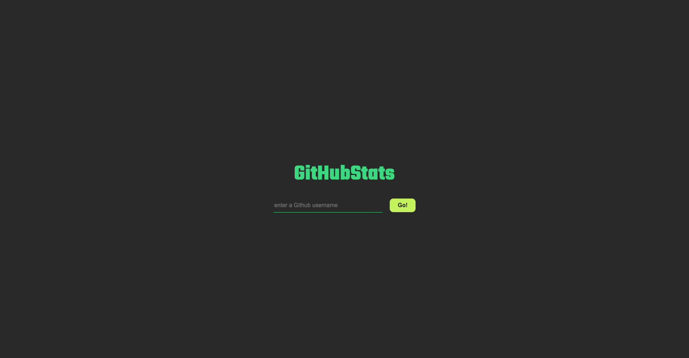
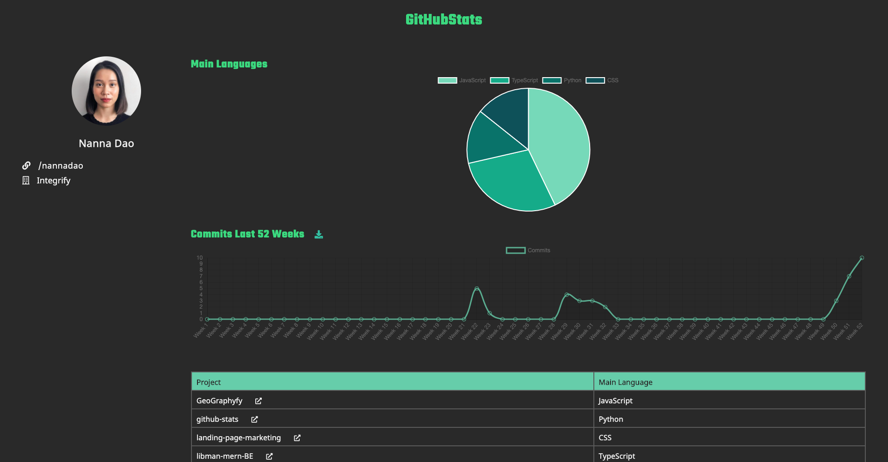

## About

This is a project using Python and Flask to visualize data and generate downloadable Excel data file. 
Project is using python v3.9 & Github API.

## Screenshots

## Usage 

`git clone git@github.com:nannadao/github-stats.git`

* Install pipenv

`pip install --user pipenv`

* Install packages

`pipenv install requests flask pandas xlsxwriter`

* Start app

`python index.py`